# Save Management

## JKSV

For save data management, [JKSV](https://github.com/J-D-K/JKSV) is recommended. It can be used to back up and restore game save data.

The documentation on this page was made in collaboration with [JK](https://github.com/J-D-K).

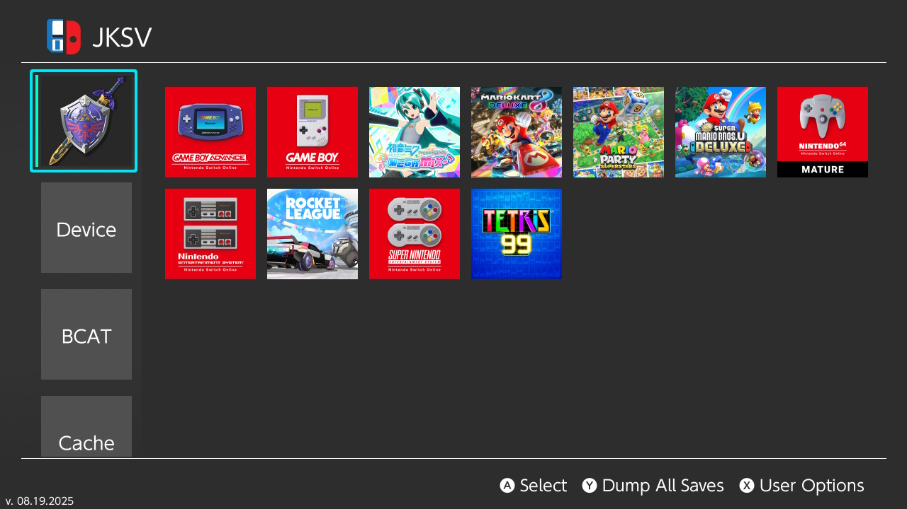

## Backing up save data using JKSV

### Instructions:

1. Launch JKSV from the homebrew menu.
1. Select your Switch user on the left side with the `A` button.
    - **Note:** If you wish to back up all save data at once, simply press `Y` while hovering over your user in the sidebar, then proceed by holding `A`.
1. Hover over your desired game and press `A` to select it.
1. Press `A` again to create a new save backup
1. Enter a name for the save data folder containing the save data and press `+` or `OK`.
1. Wait for it to finish backing up your save data.

## Restoring save data using JKSV

### Instructions:

1. Launch JKSV from the homebrew menu.
1. Select your Switch user on the left side with the `A` button.
1. Hover over your desired game and press `A` to select it.
1. Hover over the save data folder containing the save data you want to restore and press `Y`.
1. Hold the `A` button to restore the save data, keep holding it until it's finished.

## Setting up remote save data backups (Google Drive & WebDAV)

::::: tabs

:::: tab default Google Drive

JKSV features a functionality that allows you to back up your save data from the JKSV homebrew app directly to Google Drive. The setup for this feature is detailed below.

**Note:** Throughout this guide, clickable items in screenshots will be highlighted in **red**.

---

### 1. Create a new project

1. Go to [Google Cloud Console](https://console.cloud.google.com/welcome/new) and click `Select a project` (top-left corner).

    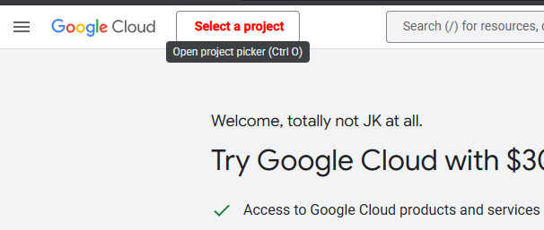

1. Click **New Project** (top-right). Name it `JKSV`. It's fine to leave `Organization` blank.

    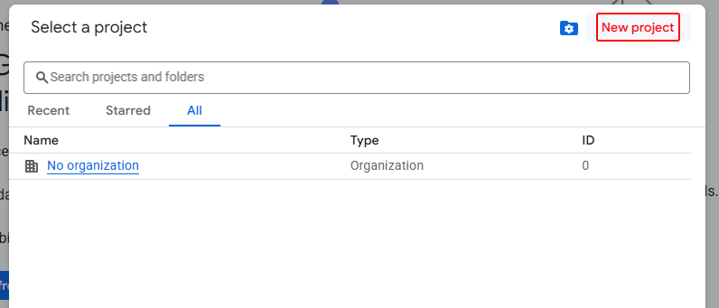
    

1. Wait for the project to be created, then click `Select Project`.

    

---

### 2. Enable the Google Drive API

1. Click the `Navigation menu` (top-left) → `APIs & Services` → `Enabled APIs & Services`.

    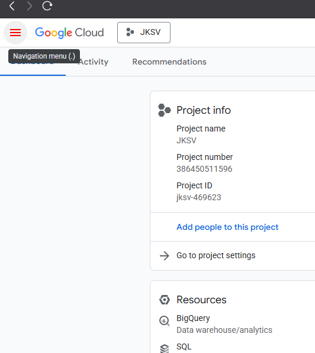
    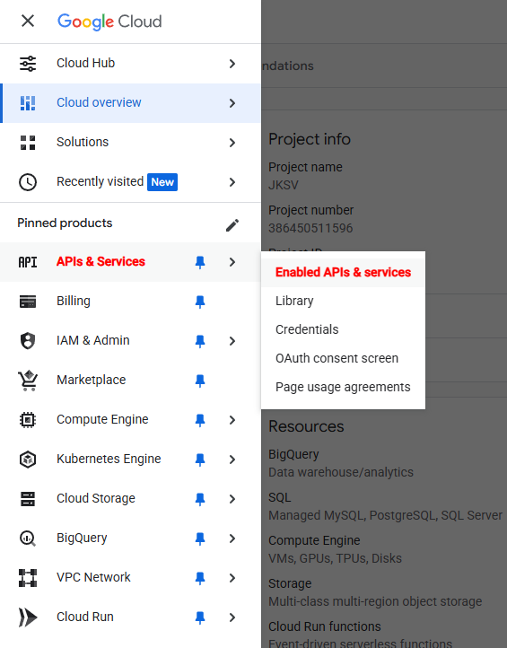

1. Click `+ Enable APIs and services`, scroll to `Google Workspace`, select `Google Drive API`, and click `Enable`.

    
    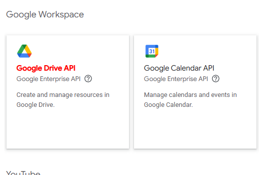
    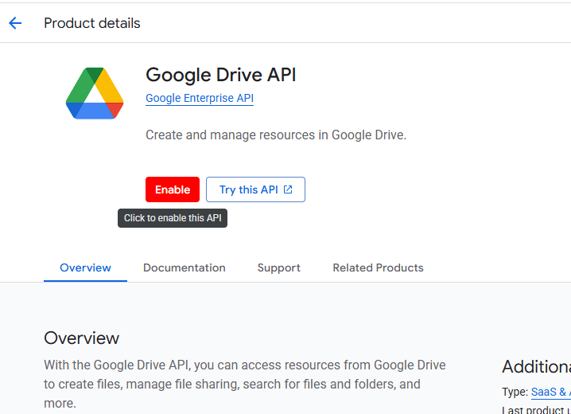

---

### 3. Create OAuth credentials

1. Go to `Credentials` → `+ Create Credentials` → `OAuth client ID`.

    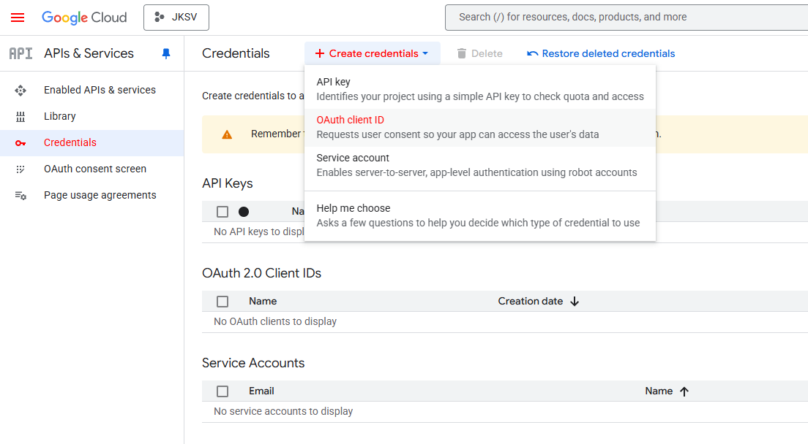

1. Click `Configure consent screen`.

    

1. Click `Get started` to start configuring Google Auth Platform.

    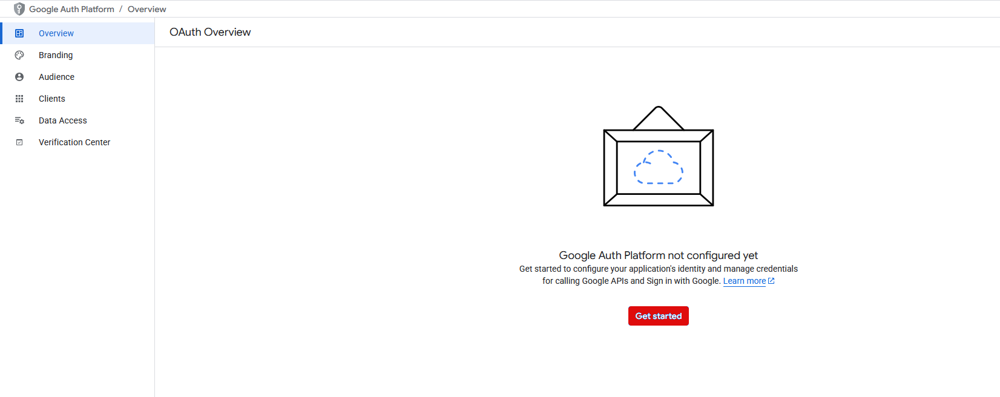

1. Fill in `JKSV` for the app name alongside the user support email (the email of the Google account you're currently using) and click `Next`.

    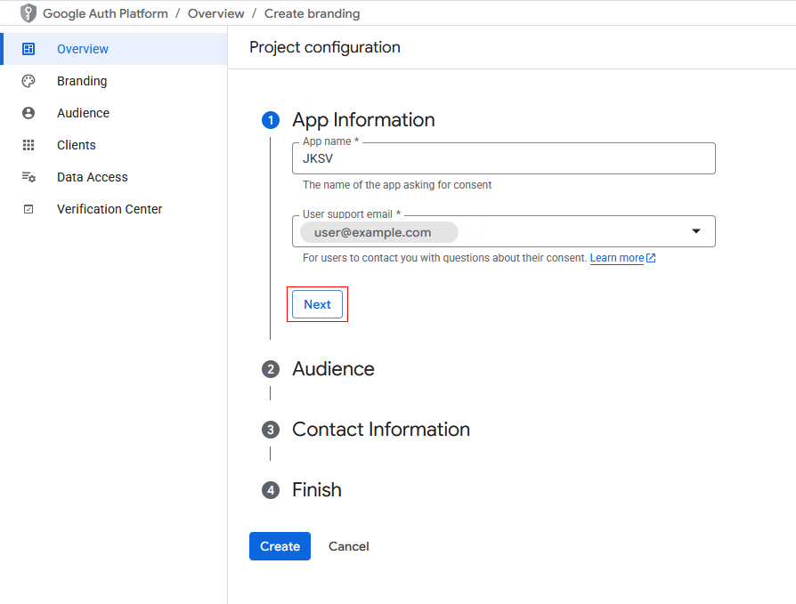

1. Select `External`, click `Next`.

    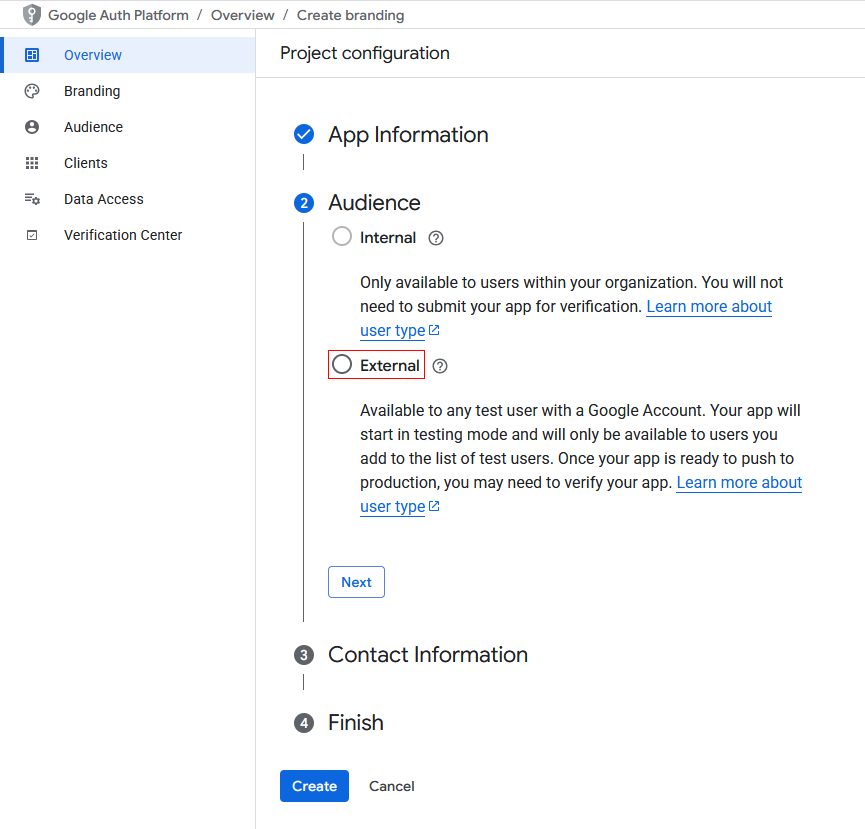
    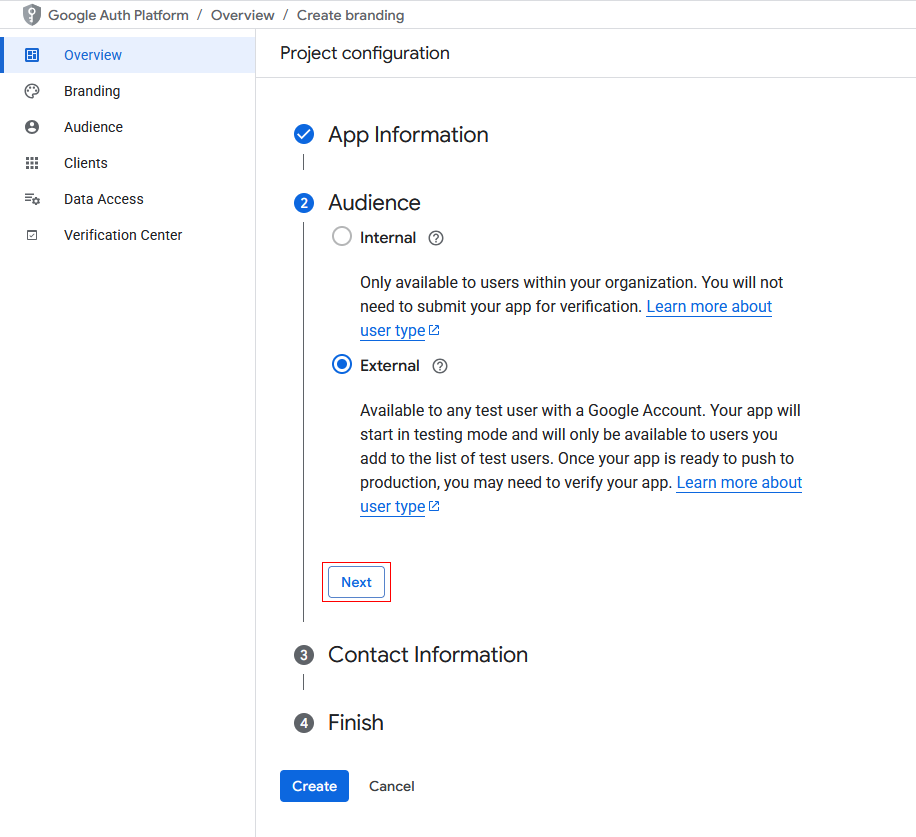

1. Fill in your own email into the contact information field and click `Next`.

    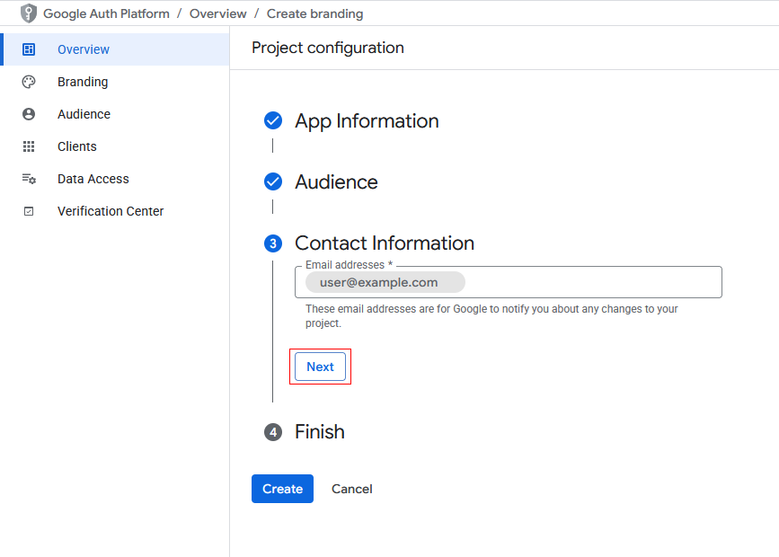

1. Click the checkbox to agree to the `Google API Services: User Data Policy` and click on `Continue`.

    

1. Now, click on `Create` and it will take you back to the overview. Click on `Create OAuth client`.

    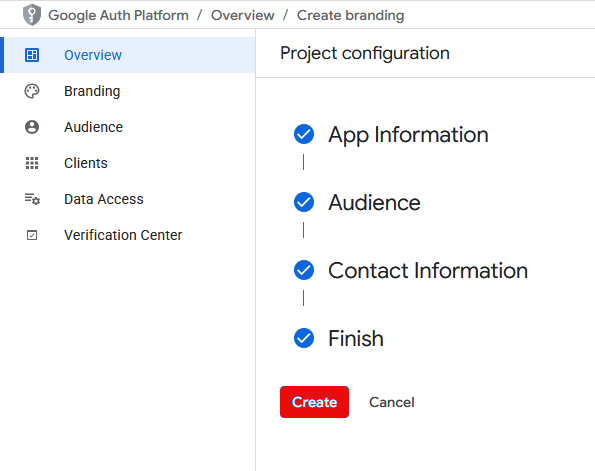
    

1. Set the `Application Type` to `TVs and limited input devices`, then set the name for the client (can be anything, the name `JKSV` is used in this guide).

    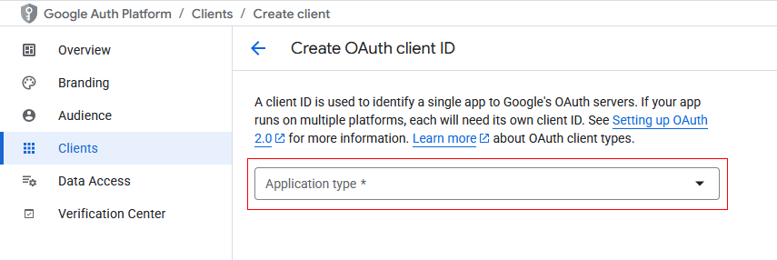
    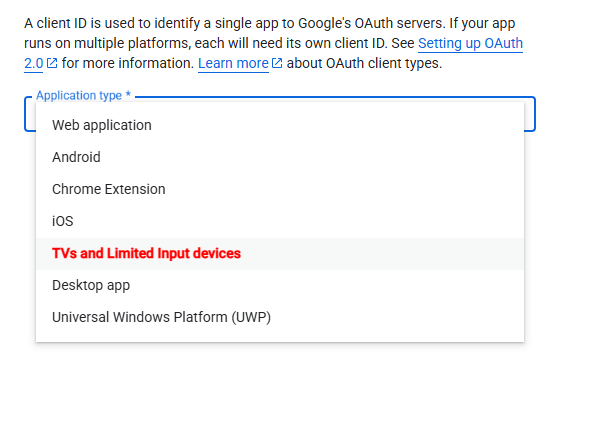
    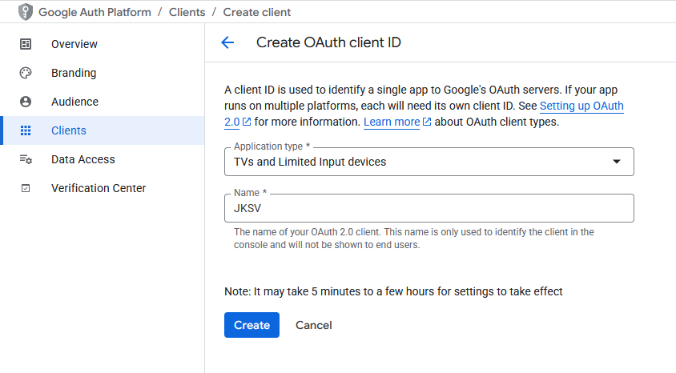

1. Click on `Create` and you will end up at the final window for this step, download the JSON file containing the client info for JKSV.

    ::: danger
    - **Note:** Google will not allow you to download this file again after this point!
    :::

    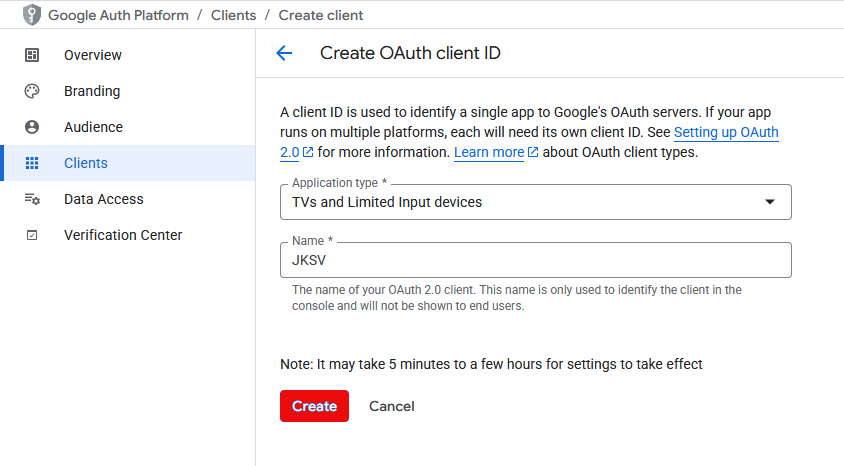
    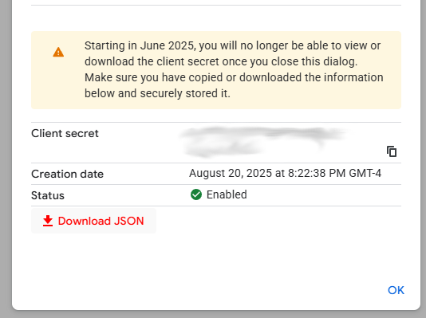

1. Rename the downloaded file to `client_secret.json` and store it somewhere safe.

    

---

### 4. Add yourself as a test user

1. Go to `Navigation menu` → `APIs & Services` → `OAuth consent screen` → `Audience`.

1. Click `+ Add users` and add your email.

    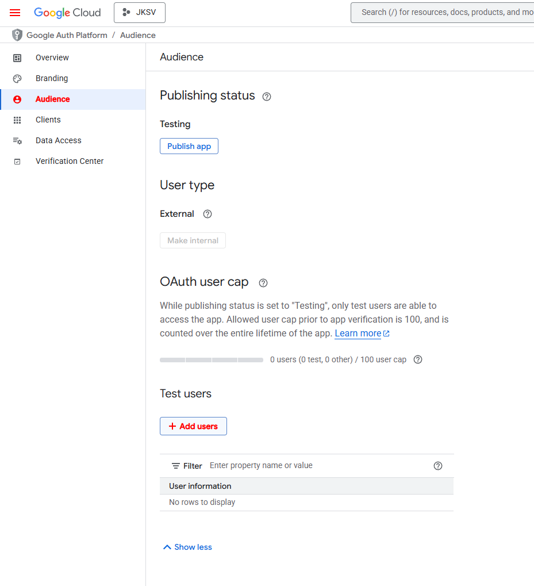
    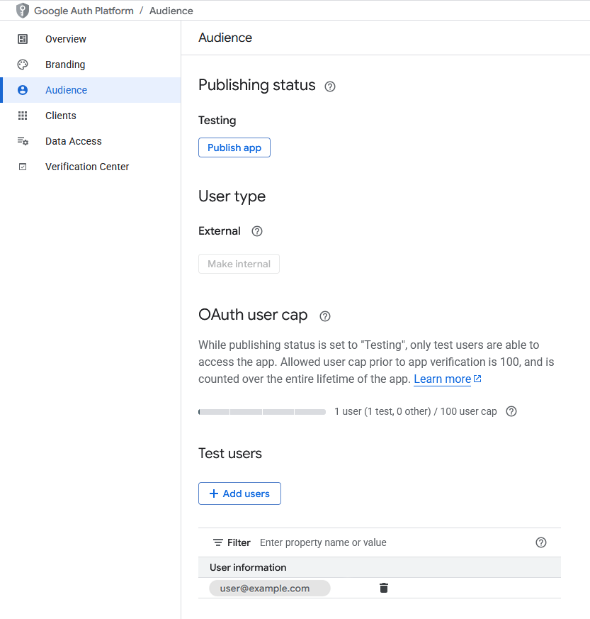

---

### **5. Copying the JSON file to your microSD card**

Copy the `client_secret.json` file to: `sd:/config/JKSV`.

### **6. Launching JKSV**

The next time JKSV starts with an internet connection, it will guide you to complete the login process by navigating to `https://google.com/device` and filling in the code mentioned in the middle of your screen in JKSV.

After the primary setup for Google Drive, you can launch JKSV with an internet connection again and it will give you a notification near the bottom of your screen stating `Successfully signed in to Google Drive!` if your configuration file was set up correctly. You can now back up and store your save data backups on Google Drive by pressing `Zr` on any save data backup!

---

### **6. (OPTIONAL BONUS STEP!)**

1. Make a secure backup of `client_secret.json` from your microSD card **after logging in with JKSV**.
    - This is recommended if you plan to share saves between multiple consoles due to Google’s OAuth scope policies.

::::

:::: tab WebDAV

JKSV features a functionality that allows you to back up your save data from the JKSV homebrew app directly to a WebDAV server. The setup for this feature is detailed below.

Please note that this feature requires you to either sign up for a WebDAV server provider or selfhost your own WebDAV server on your local network.

### 1. Creating and applying the WebDAV configuration file

1. Create a file named `webdav.json` and paste the following contents in it:
    ```
    {
        "origin": "https://example.com",
        "basepath": "path/to/JKSV",
        "username": "optional",
        "password": "optional"
    }
    ```

1. Create a folder named `JKSV` on your WebDAV server.
    - **Note:** The folder name doesn't *have* to be called `JKSV`. For the sake of this guide, `JKSV` was used for consistency purposes. 

1. Fill in the `origin`, `basepath`, `username` and `password` fields, the base path is case sensitive and beginning/trailing slashes should be left out in the `origin` and `basepath` fields. Keep the information below in mind.
    - The `origin` field should **always** contain the host portion of the WebDAV server you're connecting to.
    - The `basepath` field should either contain the absolute path to the location of the WebDAV endpoint + folder created in the previous step or you can use an aliased folder.
    - The `username` and `password` fields should contain your credentials you use to authenticate with your WebDAV server. These lines can be left out/removed entirely if you do not have authentication set up for your WebDAV server.

    If you need WebDAV configuration examples, unfold the section below.

    ::: details WebDAV configuration examples {closed}

    **Example 1:**

    Your WebDAV endpoint is hosted on a local server with IP address `192.168.1.100` with the WebDAV endpoint running at `192.168.1.100/webdav`, on which you created the `JKSV` folder. In this example you do not use any authentication.

    ```
    {
        "origin": "http://192.168.1.100",
        "basepath": "webdav/JKSV",
    }
    ```

    ---

    **Example 2:**

    Your WebDAV endpoint is hosted on a WebDAV server provider at `https://app.koofr.net/dav/Koofr`, on which you created the `JKSV` folder. In this example you *do* use authentication.

    ```
    {
        "origin": "https://app.koofr.net",
        "basepath": "dav/Koofr/JKSV",
        "username": "<Koofr email address>",
        "password": "<Generated WebDAV password>"
    }
    ```

    ---

    **Example 3:**

    Your WebDAV endpoint is hosted on a local server with IP address `192.168.1.100` with the WebDAV endpoint running at `192.168.1.100/webdav`, but you have an alias for `192.168.1.100/webdav/JKSV` set up so that your endpoint is available on `192.168.1.100/JKSV`. In this example you *do* use authentication.

    ```
    {
        "origin": "http://192.168.1.100",
        "basepath": "JKSV",
        "username": "<WebDAV username>",
        "password": "<WebDAV password>"
    }
    ```
    
    :::

### **2. Copying the JSON file to your microSD card**

Copy the `webdav.json` file to `sd:/config/JKSV`.

### 3. **Launching JKSV**

The next time JKSV starts with an internet connection, it will give you a notification near the bottom of your screen stating `WebDav successfully started!` if your configuration file was set up correctly. 

You can now back up and store your save data backups on your WebDAV server by pressing `Zr` on any save data backup!

::::

:::::


## Checkpoint

[Checkpoint](https://github.com/FlagBrew/Checkpoint) is also a save manager. It can be used to back up and restore game saves to your microSD card. It also has the ability to share save data over FTP and WiFi.

#### Checkpoint Documentation
Please read Checkpoint's [homepage](https://github.com/Flagbrew/Checkpoint) for information on how to use it.

{ width="600" }
